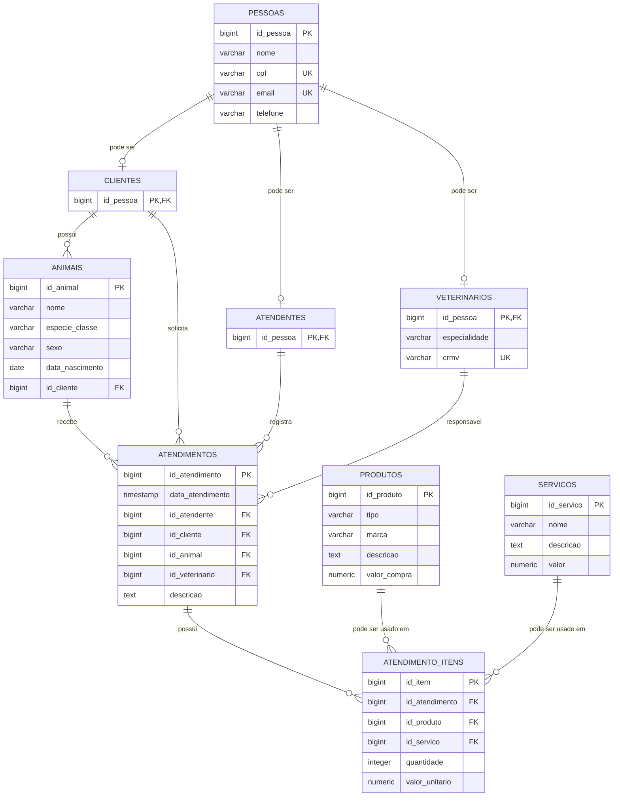

# Clínica Veterinária

## 1. Apresentação do projeto

**Tema:** Clínica Veterinária

**Objetivo geral:** desenvolver um banco de dados relacional para auxiliar no gerenciamento de uma clínica veterinária, permitindo cadastrar tutores/clientes, animais, atendentes, veterinários, produtos, serviços e atendimentos realizados.

**Público-alvo:** clínicas veterinárias, veterinários e funcionários responsáveis pelo atendimento e controle dos registros.

O sistema deve registrar os dados dos animais, seus tutores, os profissionais envolvidos em cada atendimento e os produtos e serviços utilizados, incluindo os respectivos valores.

## 2. Modelo de dados

## 3. Regras principais

- Uma pessoa pode ser cliente, atendente, veterinário ou acumular mais de uma dessas funções.
- Um cliente pode possuir vários animais.
- Cada animal possui um tutor/cliente.
- Cada atendimento possui um animal, um cliente/tutor, um atendente e um veterinário responsável.
- Um atendimento pode possuir vários itens.
- Um item pode representar um produto ou um serviço, mas não os dois ao mesmo tempo.
- O valor do item é armazenado no atendimento para preservar o valor cobrado naquele momento, mesmo que o preço do cadastro seja alterado posteriormente.

## 4. Scripts

Os scripts estão na pasta `scripts/` e seguem o padrão solicitado:

`[Versão]__[acao]_[descricao/objeto].sql`

Exemplos:

- `v1__create_tables.sql`
- `v1__insert_into_pessoas.sql`
- `v1__update_cliente.sql`
- `v1__delete_atendimento_item.sql`

## 5. PostgreSQL

O projeto foi modelado para PostgreSQL, utilizando chaves primárias, chaves estrangeiras, `NOT NULL`, `UNIQUE`, `CHECK` e `ON DELETE`/`ON UPDATE` quando apropriado.

## 6. Testes DML

Foram incluídos exemplos de `INSERT`, `UPDATE` e `DELETE` para demonstrar a manipulação dos dados e testar os relacionamentos.
